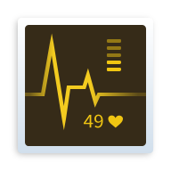

### GXDE Hardware Viewer

 **Overview 🔍** 

GXDE Hardware Manager is a lightweight hardware information viewer specifically designed for the GXDE desktop environment. It provides comprehensive system information monitoring with a clean and intuitive interface. ✨

 **Features 🚀** 

- 1. System Information 🖥️: Operating system details, kernel version, architecture, boot time

- 2. CPU Monitoring 🔢: Real-time CPU usage, frequency, core information, and driver details

- 3. Memory Tracking 🧠: RAM and swap usage with detailed statistics

- 4. Storage Analysis 💾: Disk partitions, storage devices, and I/O statistics

- 5. Network Overview 🌐: Interface information, device drivers, and traffic monitoring

- 6. Display Information 🖼️: Graphics card details, resolution, color depth, and refresh rate

- 7. Audio Devices 🔊: Input/output audio devices and driver information

- 8. Input Devices ⌨️🖱️: Keyboard, mouse, and other input device detection

- 9. Multi-language Support 🌍: English and Chinese interface

- 10. Data Export 📤: Export all hardware information to JSON format on desktop

 **Usage Instructions 📖** 

The application features a sidebar navigation with the following sections:

- 1. System 🖥️: Basic system and hardware overview

- 2. CPU 🔢: Processor details and real-time usage monitoring

- 3. Memory 🧠: RAM and swap memory statistics

- 4. Storage 💾: Disk partitions and storage device information

- 5. Network 🌐: Network interfaces and traffic data

- 6. Display 🖼️: Graphics card and display settings

- 7. Sound 🔊: Audio input/output devices

- 8. Input Devices ⌨️🖱️: Keyboard, mouse, and other input devices

- 9. Data Export 📤: Click the menu button (☰) in the top-right corner and select "Export all information to desktop" to save a comprehensive JSON file with all hardware information. 📄

 **Contribution Guidelines 🤝** 

Contributions are welcome! Please feel free to submit pull requests or open issues for bugs and feature requests. 💡

 **License 📄** 

This project is licensed under the AGPL-3.0 License - see the LICENSE file for details. ⚖️

 **Acknowledgments 🙏** 

Thanks to all the open source software we've used 🎉

Thanks to all users and contributors ❤️

Special Thanks ❤️: @zeqi, @gfdgd xi, and @shenmo - without them, this software wouldn't exist!

 **Official Website 🌐** : [www.gxde.top](http://www.gxde.top)

